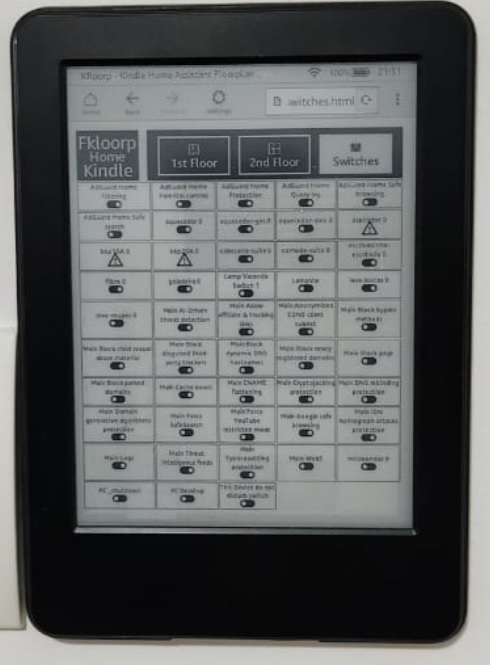
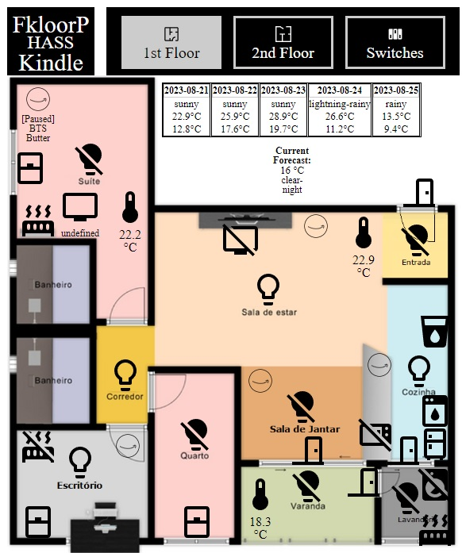

# KfloorP - Kindle Floorplan Panel for Home Assistant

**KfloorP** is a floorplan panel dashboard created for [Jaiblroken*](#requirements) Kindles, heavily based/inspired on the awesome projects [Hatki](https://github.com/tombo1337/hatki) and [Basic-Hass-Dash](https://github.com/nirkons/Basic-Hass-Dash).

It focus on depending on anything else besides Home Assistant to fetch the data, and to be easy to deploy and maintain.

## Features

* It mimics the basic functionalities from the HomeAssistant LoveLace piture-elements card
* Easy to add/change/remove devices
* (Almost) Online Device State Tracking Changes
* No HTML/CSS editing required
* Supports all the following Home Assistant Domains Entities and basic features:
    * **SWITCH** - with the possibility to customize with the following Icons:
        * **washingmachine, microwave, smartplug, dishwasher, heater, fridge, waterfountain**
    * **BINARY_SENSOR** - with the possibility to customize with the following Icons:
        * **window, door**
    * **SENSOR** - with the possibility to customize with the following Icons:
        * **battery, temperature, humidity**
    * **MEDIA_PLAYER** - with **Current Media Display**, **Play/Pause Control** and with the possibility to customize with the following Icons:
        * **tv, alexa, googleassistant**
    * **WEATHER** - with **5 day Forecast function** or **Single Temperature**   
* 2nd Floor Support, automatically hidden if no devices informed
* Dedicated Pages with all HA Switches, showing up to 50 devices

## Requirements

* Your Home Assistant Internal URL with no TLS(SSL) encryption (http not https).
* Your floorplan images for background and your device names from Home Assistant entities.
* A Home Assistant [Long Lived Access Token](https://www.home-assistant.io/docs/authentication/), created from your Account Profile directly on HA.
* Kindle Touch 2nd generation or newer.
    * Jailbroken device is preferred but not required, as you need this hack to prevent the native screensaver and to make the device go on full Kiosk Mode.
    * Kindle Jailbreak guides can be found in [here](https://www.mobileread.com/forums/showthread.php?t=346037)
* A WebServer. It runs in almost any basic webserver like httpd/Apache, etc.. Here are some options:
    * **If you do not expose your HA to the Internet:** you can use HA to host the files, by coping them to your **/config/www** folder, and them acces it trough your internal HA URL /local path. (e.g http://192.168.182.10:200/local/kafloorp/index.html). Don't do this if your instance is exposed to Internet, as everyone will have access to your dashboard, with no authentication required.
    * **If you use Home Assistant OS:** Any of the **Apache2 Addons** from the excelent repository [hassio-addons](https://github.com/FaserF/hassio-addons) maintained by [FaserF](https://github.com/FaserF).
    * **If you use Docker:** [httpd Official Image](https://hub.docker.com/_/httpd)

## Deployment / Installation

1. After you have your webhost setup, you need to copy all the *.html files, the css folder with its content and the data.js file from this repo to a folder of your preference (or in the root) of your webhost.
The structure should be like this:
> ./kfloorp/css/common-style.css
> ./kfloorp/data.js
> ./kfloorp/2ndfloor.html
> ./kfloorp/switches.html

Also add your floorplan images to the same path if you want to host all the files together.

2. Go to your configuration.yaml from your Home Assistant installation add the **"cors_allowed_origins"** to the *http* node config with your webserver IP or URL. (The one you will enter on kindle to open KfloorP)
>http:
  cors_allowed_origins:
    - 'null'
    - http://YOUR:WEBSERVER:IP:ADDRESS:YOUR_SERVERPORT
    - http://YOUR:WEBSERVER:IP:ADDRESS:YOUR_SERVERPORT/

3. Open the **data.js** file on your webserver using any text editor and follow the instructions inside to add your Home Assistant IP/URL, your LongLived Token your floorplan images and your devices.

4. Go to the Experimental Web Browser on your Kindle or any PC Browser and open your webserver URL to check it out. Eg: http://x.x.x.x:8080/kafloorp/index.html

## Development

The majority of the development is done using the ancient JavaScript ES3 standard, with a few CSS stylization and pure HTML. As Kindle Web Support is not well documented and it does not necessarily behaves like a PC Browser, a lot of hacks was used to make this work. I'm not a developer and the code is ugly as hell.

Any PR Should be preferably tested on a real Kindle before submitted, but are always welcomed.

